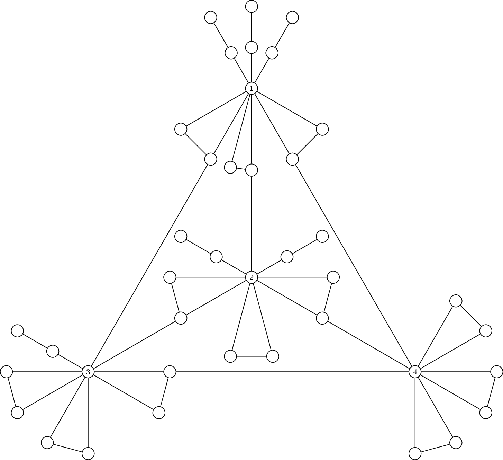

I'm a maths undergraduate at the University of St Andrews and 2025 Laidlaw Leadership and Research Scholar.

My 2025 summer research project was in Algebraic Graph Theory, and was related to graph reconstruction.
Here's my [poster](pdfs/Laidlaw_Research_Poster.pdf) and [research essay](pdfs/Laidlaw_Research.pdf).

I also contribute to the Digraphs package for GAP. Here's an explanatory [note](pdfs/Is2EdgeTransitive.pdf) on the function
Is2EdgeTransitive.

In summer 2026, I'll be going to Boston MA to teach HTML, CSS and web design principles with the [Timothy Smith Network](https://timothysmithnetwork.org/)
as part of my second summer with Laidlaw. I also plan to complete another research project in Pure Mathematics.

For the things I've done, see my [CV](pdfs/CV.pdf) or my [LinkedIn](https://www.linkedin.com/in/frankie-gillis/).

In the above graph, the vertices labelled $1$, $2$, $3$, and $4$ have pairwise-isomorphic vertex-deleted subgraphs, but no automorphism of the graph maps one onto the other. We call vertices
having this property (mutually) *pseudo-similar*. Such graphs were the focus of my 2025 summer research.
